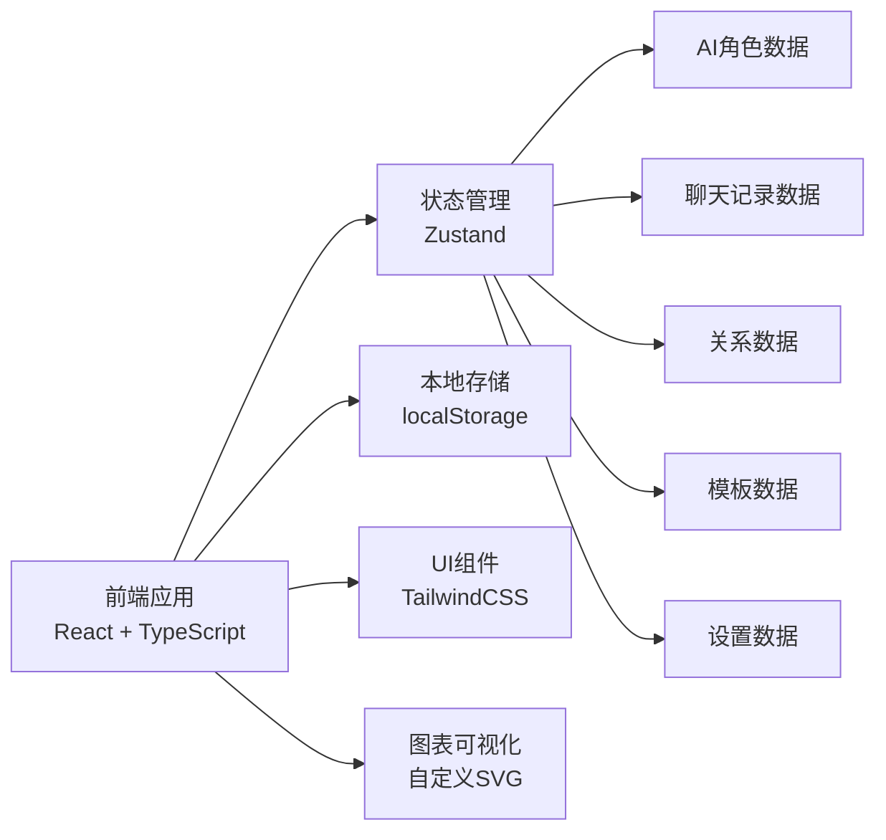

# AI 互聊 - 技术架构文档

## 1. 架构设计



## 2. 技术栈说明

- **前端框架**：React 18 + TypeScript
- **构建工具**：Vite 5
- **样式方案**：TailwindCSS 3
- **状态管理**：Zustand (轻量级状态管理)
- **图标库**：Lucide React
- **数据持久化**：localStorage
- **AI对话模拟**：本地规则引擎模拟（纯前端，无需后端）

### 选择理由

- **纯前端**：所有数据本地存储，无需后端服务
- **React + TypeScript**：类型安全，组件化开发，便于维护
- **Zustand**：轻量级状态管理，API 简洁，适合中小型应用
- **TailwindCSS**：快速开发，样式统一，响应式友好
- **localStorage**：简单可靠的本地数据持久化方案

## 3. 路由定义

| 路由路径 | 页面名称 | 说明 |
|----------|----------|------|
| / | 角色广场 | 默认首页，展示所有AI角色 |
| /my-ai | 我的AI | 个人AI管理和模板 |
| /chat | 聊天室 | 多AI对话主界面 |
| /relations | 关系网 | 角色关系可视化 |
| /scriptboard | 剧本板 | 开场生成和剧本管理 |
| /playback | 回放库 | 历史记录和收藏 |
| /settings | 设置 | 应用设置 |

## 4. 数据模型

### 4.1 AI 角色 (AIActor)

```typescript
interface AIActor {
  id: string;
  name: string;
  avatar: string;
  tone: string;
  memory: string;
  taboo: string;
  tags: string[];
  createdAt: number;
  updatedAt: number;
}
```

### 4.2 角色关系 (Relation)

```typescript
interface Relation {
  id: string;
  actorId1: string;
  actorId2: string;
  intimacy: number; // 0-100 亲密度
  stance: 'friendly' | 'neutral' | 'hostile' | 'complex';
  description: string;
}
```

### 4.3 聊天室 (ChatRoom)

```typescript
interface ChatRoom {
  id: string;
  name: string;
  mode: 'group' | 'one-on-one';
  actorIds: string[];
  messages: ChatMessage[];
  isPinned: boolean;
  createdAt: number;
  updatedAt: number;
}
```

### 4.4 聊天消息 (ChatMessage)

```typescript
interface ChatMessage {
  id: string;
  type: 'ai' | 'narration' | 'system';
  actorId?: string;
  content: string;
  timestamp: number;
  isFavorite: boolean;
  isEdited: boolean;
  pinnedMemory?: string;
}
```

### 4.5 剧本 (Script)

```typescript
interface Script {
  id: string;
  title: string;
  theme: string;
  opening: string;
  actorIds: string[];
  createdAt: number;
  updatedAt: number;
}
```

### 4.6 对话记录 (ChatRecord)

```typescript
interface ChatRecord {
  id: string;
  title: string;
  summary: string;
  actorIds: string[];
  messages: ChatMessage[];
  isFavorite: boolean;
  createdAt: number;
  duration: number; // 对话时长（秒）
}
```

### 4.7 模板 (Template)

```typescript
interface Template {
  id: string;
  name: string;
  description: string;
  actors: AIActor[];
  relations: Relation[];
  createdAt: number;
}
```

### 4.8 应用设置 (AppSettings)

```typescript
interface AppSettings {
  theme: 'dark' | 'light';
  language: 'zh-CN';
  chatSpeed: 'slow' | 'normal' | 'fast';
  autoPlay: boolean;
  exportFormat: 'txt' | 'json' | 'md';
}
```

## 5. 目录结构

```
src/
├── components/          # 通用组件
│   ├── layout/         # 布局组件
│   ├── ui/             # 基础UI组件
│   └── ...
├── pages/              # 页面组件
│   ├── Square/         # 角色广场
│   ├── MyAI/           # 我的AI
│   ├── Chat/           # 聊天室
│   ├── Relations/      # 关系网
│   ├── ScriptBoard/    # 剧本板
│   ├── Playback/       # 回放库
│   └── Settings/       # 设置
├── store/              # 状态管理
│   ├── useActorStore.ts
│   ├── useChatStore.ts
│   ├── useRelationStore.ts
│   ├── useScriptStore.ts
│   ├── useRecordStore.ts
│   ├── useTemplateStore.ts
│   └── useSettingStore.ts
├── types/              # TypeScript 类型定义
│   └── index.ts
├── utils/              # 工具函数
│   ├── storage.ts      # localStorage 封装
│   ├── aiEngine.ts     # AI对话模拟引擎
│   └── helpers.ts
├── data/               # Mock数据
│   └── mockData.ts
├── hooks/              # 自定义hooks
├── App.tsx
├── main.tsx
└── index.css
```

## 6. AI 对话模拟引擎设计

由于是纯前端应用，采用**本地规则引擎**模拟AI对话：

### 6.1 核心规则

- **轮流发言**：群聊模式下AI按顺序轮流发言
- **记忆系统**：每个AI根据自己的记忆和对话历史生成回应
- **关系影响**：亲密度和立场影响对话内容和语气
- **话题延续**：AI会基于前一条消息的内容进行回应
- **语气风格**：根据设定的语气生成不同风格的回复

### 6.2 发言内容生成

- 基于预定义的话术模板和角色设定
- 根据上下文随机选择合适的回应
- 支持插入话题转折和情绪变化
- 可通过固定记忆引导对话方向

### 6.3 发言间隔

- 可配置的发言速度（慢/正常/快）
- 随机化间隔时间，模拟真实思考
- 支持手动暂停和继续
